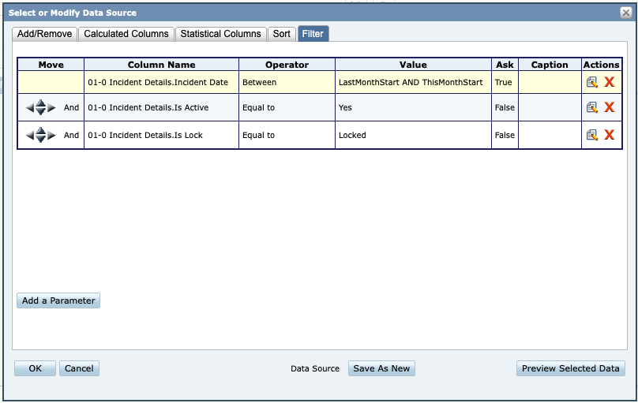

```{r, include = FALSE}
knitr::opts_chunk$set(
  collapse = TRUE,
  comment = "#>"
)
```

EMS electronic patient care records (ePCRs) are standardized around the NEMSIS data specifications and capture a robust set of information about each patient encounter. Accessing these records programmatically can be challenging, and especially so for records from ESO EHR. This package streamlines many of these steps by storing the data in flat files with a predictable structure and then creating import helper functions to accomplish routine tasks.

# How to Download ESO Data
The data import process starts by downloading CSV files from ESO Ad Hoc. The easiest approach to do this is to construct prebuilt reports that can be run on a monthly basis. Each report should include the "01-0 Incident Details" table (for use in the Data Source filter) and the table of interest (see below). The report filter should default to pulling one month's worth of data for active, locked records.


The report should include every column contained in the Ad Hoc datasource table. The following reports should be created and run.

|Ad Hoc Table                                    |Use Tablename|Description                                                               |
|------------------------------------------------|-------------|--------------------------------------------------------------------------|
|01-0 Incident Details                           |Incidents    |Contains information from Incident tab.                                   |
|02-0 Patient Information                        |Patient_Info |Patient demographics.                                                     |
|02-1 Patient Allergies                          |Allergies    |A list of the patient's allergies.                                        |
|02-5 Patient Personnel                          |Personnel    |A list of the personnel on the call and their roles (Lead, Driver, Other) |
|03-0 VitalSign                                  |Vitals+      |All of the vital signs collected for each record.                         |
|04-0 Narrative                                  |Narrative    |Field impressions, chief complaint, signs/symptoms, and written narrative.|
|05-01 Sp Patient ACS                            |ACS          |STEMI/ACS form values                                                     |
|05-02 Sp Patient Advanced Airway                |eAirway      |Airway form values                                                        |
|05-03 Sp Patient CPR                            |CPR          |CPR form values                                                           |
|05-14 Specialty PAtient Trauma Criteria CDC2011 |Trauma       |Trauma criteria form values                                               |
|06-01 FlowChart Treatment - Airway              |Airway       |All of the treatments from the Airway tab                                 |
|06-02 FlowChart Treatment - Critical Care       |Labs         |All of the treatments from the Critical Care tab.                         |
|06-03 FlowChart Treatment - Defib_Cardio_Pace   |Cardiac      |All of the Cardiac treatments                                             |
|06-04 FlowChart Treatment - IV Therapy          |IV           |All of the IV treatments                                                  |
|06-05 FlowChart Treatment - Medication          |Medications  |All Medications treatments                                                |
|06-06 FlowChart Treatment - Other               |General      |All other treatments                                                      |
|09-02 AdHoc_ClinicalReviews                     |QM           |Clincal review QM feedback, messages, and notes.                          |
|Ad Hoc_ Specialty_ Patient_ Fast + Ad Hoc_ Specialty Patient_ Race |Stroke exam records for RACE and FAST scores.                        |

Due to schema changes on Ad Hoc end, there are a few additional modifications:

- *CPR* table includes nearly all columns from "05-03 Sp Patient CPR" but adds in "05-03-2 Sp Patient CPR Rhythm at Destination.Rhythm at Destination", "05-03-3 Sp Patient CPR - Arrest Witnessed By.Arrest Witnessed By", and "05-03-1 Sp Patient CPR - Type of CPR.Type of CPR". This can create duplicate rows in the CPR entry but reflect the multiple values possible in these fields.

These reports should be run either for an entire year or for an entire month, and the resulting file saved with the filename formatted as "YYYY_MM_tablename.csv" or "YYYY_tablename.csv". For example, the patient information report for October 2020 would be saved as "2020_10_Patient_Info.csv" and the airway treatments report for the year of 2019 would be saved as "2019_Airway.csv".

### Exceeded Base Rows error
Some reports will generate an error in Ad Hoc if they exceed an internal limit on rows returned (typically 64,000). In this case, save the files as two or more separate files using a suffix "_A", "_B", "_C" etc. Then, use the `merge_eso_data` function to combine them. For instance, the 2020 files for personnel had to be split into "2020_Personnel_A.csv" and "2020_Personnel_B.csv" (by setting the filters to January - June then July - December).

```r
library(groverr)
merge_eso_data("2020", table_name = "Personnel")
# Console prompt: Choose file(s) to merge. Separate multiple numbers with a comma.
#                 a: All files
#                 0: No files
#                 1: 2020_Personnel_A.csv
#                 2: 2020_PersonneL_B.csv
# Entering "a" then enter saves the merged file as "2020_Personnel.csv"
```

# How to Import Patient Care Records for Analysis
Every import function requires specifiying the year and month. These are specified as strings, i.e. `"2020"`. If month is blank or set to `FALSE` then the function looks for the entire year.

The basic import function is `import_eso_data()` which requires specifying year, month, and table_name from above. This works in most cases, however it may not set the right data types and won't include additional features.

Table-specific import functions include:

- `import_patients()`
- `import_incidents()`
- `import_vitals()`
- `import_treatments()`
- `import_stroke()`
- `import_narrative()`
- `import_cpr()`

Some additional import related tools:

- `join_crew()` takes any of the imported ESO dataframes and adds columns for "Lead" and "Driver" with the crew names from those roles.
- `filtered_incidents()` is imports incidents but only includes incidents that have a match from another dataset. See below for use case.
- `import_all_data()` Will import every table in the root directory for a given table name. This can result in a lot of duplicates, so use with caution.

## Import Workflow
Most analysis steps begin by importing the incidents table, then adding additional tables using joins. This is best accomplished with the following steps:

```
library(groverr)
incidents <- import_incidents("2020", "02") %>%
  left_join(import_narrative("2020", "02"), by="PatientCareRecordId")
```
This code imports incidents for the given month, then adds all the values for the narrative table. This can be repeated as needed.

## Filtering Incidents
Since many analyses are only looking for a specific type of patient case, the filter workflow can be useful.
```
library(groverr)

# Find all of the STEMI alerts
STEMI_alerts <- import_treatments("2020", "02") %>% 
  filter(`Treatment Name` == "STEMI Alert")

# Get incidents that had a STEMI alert performed
#   Doesn't include any of the STEMI_alert data, only filters.
stemi_incidents <- filtered_incidents("2020", "02", STEMI_alerts)

# Find all medical chest pain calls
acs_narrative <- import_narrative("2020", "02") %>% 
    filter(`Primary Impression` %in% c("Chest Pain (Non-Cardiac)", "Chest Pain / Discomfort")) %>% 
    filter(`Medical Trauma` == "Medical")

# Get incidents that were medical chest pain calls, and include narrative fields
acs_incidents <- filtered_incidents("2020", "02", acs_narrative, .left_join=TRUE)
```

